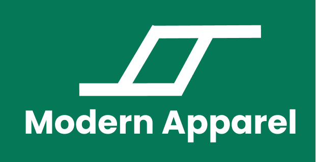
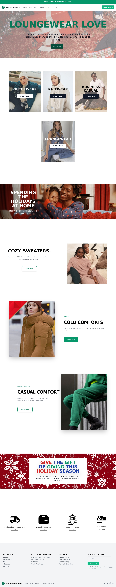

# Moden Apparel - Landing Page

Modern Apparel Is An Ecommerce Landing Page Built With Next.js and Tailwind CSS.

## Screenshots
Light Mode:


Dark Mode:


## Shop Page
For the shop page, please visit the `shop` branch in this repository.

## Software & Resources
- React
- Next.js
- Tailwind CSS

## Develop Locally

First, install the depedencies:

```bash
npm install
# or
yarn install
```

Then, run the development server:

```bash
npm run dev
# or
yarn dev
```

## Star ⭐

If you find this project helpful, please star this repository. 

## License
[](https://www.gnu.org/licenses/gpl-3.0)
View more information in [LICENSE.md](LICENSE.md)

## Credits
- This is a [Next.js](https://nextjs.org/) project bootstrapped with [`create-next-app`](https://github.com/vercel/next.js/tree/canary/packages/create-next-app).
- All images are property of their respective owners.

## Learn More

To learn more about Next.js, take a look at the following resources:

- [Next.js Documentation](https://nextjs.org/docs) - learn about Next.js features and API.
- [Learn Next.js](https://nextjs.org/learn) - an interactive Next.js tutorial.
- You can check out [the Next.js GitHub repository](https://github.com/vercel/next.js/)

To learn more about Tailwind CSS, take a look at the following resources:

- [Tailwind CSS Documentation](https://tailwindcss.com/docs/installation) - learn about Tailwind CSS features and how to get started.
- You can check out [the tailwindcss GitHub repository](https://github.com/tailwindlabs/tailwindcss)